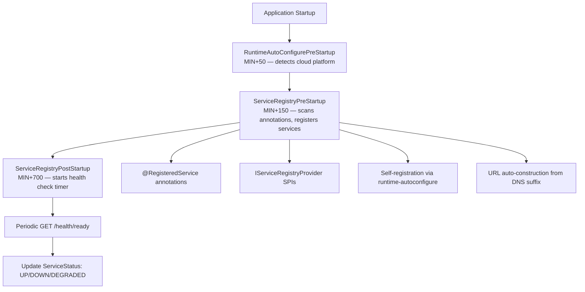
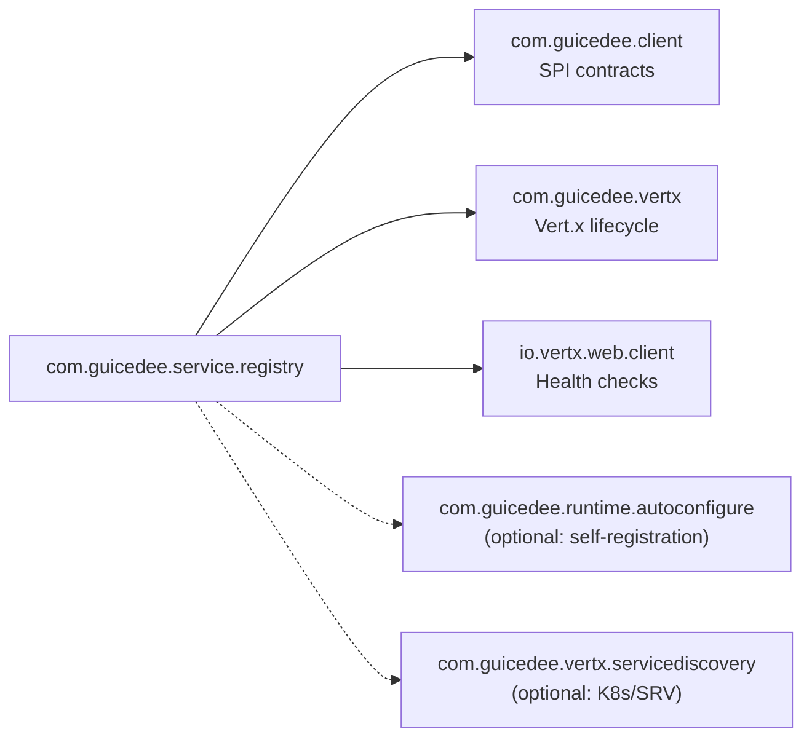

# GuicedEE Service Registry

[](https://github.com/GuicedEE/ServiceRegistry/actions/workflows/build.yml)
[](https://github.com/GuicedEE/ServiceRegistry)
[](https://www.apache.org/licenses/LICENSE-2.0)


Named service registry with health-aware resolution for GuicedEE. Register services by simple name, auto-construct URLs from cloud DNS suffix, monitor health status, and resolve services via `registry:name` prefix in rest-client `@Endpoint`.

Built on [Vert.x 5](https://vertx.io/) · [Google Guice](https://github.com/google/guice) · JPMS module `com.guicedee.service.registry` · Java 25+

## 📦 Installation

```xml
<dependency>
  <groupId>com.guicedee</groupId>
  <artifactId>service-registry</artifactId>
</dependency>
```

<details>
<summary>Gradle (Kotlin DSL)</summary>

```kotlin
implementation("com.guicedee:service-registry:2.1.0-SNAPSHOT")
```
</details>

## ✨ Features

- **Simple name resolution** — `ServiceRegistry.url("jwebmp-website")` returns the full URL
- **Auto-URL construction** — builds URLs from cloud DNS suffix (Azure, K8s, etc.)
- **Health monitoring** — periodic health checks via Vert.x WebClient
- **Per-service health paths** — each service can specify its own health endpoint
- **Annotation-driven** — `@RegisteredService(name = "...")` declares known services
- **Aliases** — resolve services by alternative names (e.g. `url("jwebmp")` → jwebmp-website)
- **External URLs** — multiple public/custom domain URLs per service
- **Kubernetes URLs** — separate internal cluster URLs with fallback to primary
- **Self-registration** — auto-registers this app using runtime-autoconfigure metadata
- **rest-client integration** — `@Endpoint(url = "registry:service-name")` or bare name resolves from registry
- **Pluggable sources** — `IServiceRegistryProvider` SPI for external catalogs (Consul, Azure API, etc.)
- **Environment variable support** — `${VAR}` placeholders in URLs
- **Status-aware** — UP, DOWN, DEGRADED, UNKNOWN states per service

## 🚀 Quick Start

**Step 1** — Declare your sibling services on `package-info.java`:

```java
@ServiceRegistryOptions(healthCheckInterval = 30)
@RegisteredService(name = "jwebmp-website",
    aliases = {"jwebmp", "jwebswing"},
    externalUrls = {"https://jwebmp.com", "https://jwebswing.com"},
    kubernetesUrl = "http://jwebmp-website.default.svc.cluster.local")
@RegisteredService(name = "payment-api", url = "${PAYMENT_URL}", healthPath = "/status")
@RegisteredService(name = "hello-service",
    url = "http://hello-service.myns.svc.cluster.local",
    healthPath = "/healthz")
package com.myapp;

import com.guicedee.service.registry.*;
```

**Step 2** — Use services by name:

```java
// Get URL (throws if not registered)
String url = ServiceRegistry.url("jwebmp-website");

// Alias resolution
String url = ServiceRegistry.url("jwebmp"); // resolves to jwebmp-website

// External/public URL (custom domain)
String ext = ServiceRegistry.externalUrl("jwebmp-website");
// → https://jwebmp.com

// Multiple external URLs
List<String> exts = ServiceRegistry.externalUrls("jwebmp-website");
// → [https://jwebmp.com, https://jwebswing.com]

// Kubernetes internal URL
String k8s = ServiceRegistry.kubernetesUrl("jwebmp-website");
// → http://jwebmp-website.default.svc.cluster.local

// Get URL only if healthy
Optional<String> url = ServiceRegistry.healthyUrl("jwebmp-website");

// Check all healthy services
Map<String, ServiceEntry> healthy = ServiceRegistry.healthy();
```

**Step 3** — With rest-client (three formats supported):

```java
// Explicit registry: prefix
@Endpoint(url = "registry:jwebmp-website")
@Named("jwebmp")
private RestClient<Void, Response> jwebmpClient;

// Bare service name (auto-detected from registry)
@Endpoint(url = "jwebmp-website")
@Named("jwebmp")
private RestClient<Void, Response> jwebmpClient;

// Full URL (passes through unchanged)
@Endpoint(url = "https://api.example.com/v1")
@Named("example")
private RestClient<Void, Response> exampleClient;
```

## 📐 Architecture



## ⚙️ Configuration

### @ServiceRegistryOptions

| Property | Default | Purpose |
|---|---|---|
| `healthCheckInterval` | `30` | Seconds between health checks (0 = disabled) |
| `healthPath` | `"/health/ready"` | Default health endpoint path |
| `registerSelf` | `true` | Auto-register this app from runtime-autoconfigure |
| `healthCheckTimeout` | `5000` | HTTP timeout in ms for health checks |
| `useHttps` | `true` | Use HTTPS for auto-constructed URLs |
| `defaultPort` | `0` | Port for auto-constructed URLs (0 = omit) |

### @RegisteredService

| Property | Default | Purpose |
|---|---|---|
| `name` | (required) | Simple logical service name |
| `url` | `""` | Full URL (empty = auto-construct from DNS suffix). Supports `${ENV_VAR}` |
| `healthPath` | `""` | Health path override (empty = uses registry default) |
| `aliases` | `{}` | Alternative names that resolve to this service |
| `externalUrls` | `{}` | External/public URLs (custom domains). Supports `${ENV_VAR}` |
| `externalUrl` | `""` | Single external URL shorthand. Supports `${ENV_VAR}` |
| `kubernetesUrl` | `""` | Kubernetes internal cluster URL. Supports `${ENV_VAR}` |

### Environment Variables

| Variable | Purpose |
|---|---|
| `SERVICE_REGISTRY_DNS_SUFFIX` | DNS suffix for URL construction (fallback) |
| `CONTAINER_APP_ENV_DNS_SUFFIX` | Azure Container Apps DNS suffix (auto-detected) |

## 🔌 SPI & Extension Points

| SPI | When | Purpose |
|---|---|---|
| `IServiceRegistryProvider` | During pre-startup | Provide services from external catalogs |

### Custom Provider

```java
public class AzureCatalogProvider implements IServiceRegistryProvider<AzureCatalogProvider> {
    @Override
    public List<ServiceEntry> discover() {
        // Call Azure API, return all container apps
    }

    @Override
    public String providerId() { return "azure-catalog"; }
}
```

Register in `module-info.java`:
```java
provides IServiceRegistryProvider with AzureCatalogProvider;
```

## 🧩 Integration with rest-client

When service-registry is on the classpath, `@Endpoint` URLs can use the `registry:` prefix:

```java
@Endpoint(url = "registry:jwebmp-website")
@Named("jwebmp-api")
private RestClient<Void, Response> client;
```

The rest-client resolves `registry:jwebmp-website` → `ServiceRegistry.url("jwebmp-website")`.

## 🗺️ Module Graph



## 🧩 JPMS

Module name: **`com.guicedee.service.registry`**

```java
module my.app {
    requires com.guicedee.service.registry;
}
```

## 🏗️ Key Classes

| Class | Package | Role |
|---|---|---|
| `ServiceRegistry` | `registry` | Central static registry — get/register/resolve by name |
| `ServiceEntry` | `registry` | Record: name, url, healthPath, status, metadata |
| `ServiceStatus` | `registry` | Enum: UP, DOWN, UNKNOWN, DEGRADED |
| `ServiceRegistryOptions` | `registry` | Annotation: health interval, HTTPS, self-register |
| `RegisteredService` | `registry` | Annotation: declares a known service (repeatable) |
| `IServiceRegistryProvider` | `registry` | SPI for external service catalogs |
| `ServiceRegistryPreStartup` | `implementations` | Scans annotations, constructs URLs, registers services |
| `ServiceRegistryPostStartup` | `implementations` | Starts Vert.x periodic health check timer |

## 🤝 Contributing

Issues and pull requests are welcome — please add tests for new registry providers or health check strategies.

## 📄 License

[Apache 2.0](https://www.apache.org/licenses/LICENSE-2.0)

